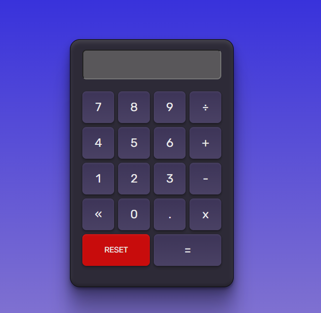

#  Aplicativo de Calculadora

Esta é uma  a [Calculadora ](https://www.frontendmentor.io/challenges/calculator-app-9lteq5N29). criada com funções construtoras

Os desafios do Frontend Mentor nos ajudam a melhorar nossas habilidades de codificação ao construir projetos realistas. 

## Índice

- [Aplicativo de Calculadora](#aplicativo-de-calculadora)
  - [Índice](#índice)
  - [Visão Geral](#visão-geral)
    - [**O desafio**](#o-desafio)
    - [**Captura de tela**](#captura-de-tela)
    - [**Links**](#links)
  - [Meu processo](#meu-processo)
    - [**Construído com**](#construído-com)
    - [**O que eu aprendi**](#o-que-eu-aprendi)
    - [**Desenvolvimento continuado**](#desenvolvimento-continuado)
    - [**Recursos úteis**](#recursos-úteis)
  

## Visão Geral

### **O desafio**

Os usuários devem ser capazes de:

- Ver o tamanho dos elementos ajustados com base no tamanho da tela de seus dispositivos
- Realizar operações matemáticas como adição, subtração, multiplicação e divisão
- Pressionando a tecla Esc limpa o display.

### **Captura de tela**


<br><br>


### **Links**

- Site URL: [Calculator App](https://loquacious-moxie-33dc41.netlify.app/)

## Meu processo

### **Construído com**

- HTML5
- CSS3
- Flexbox - CSS3
- JavaScript
- Função Construtora - JavaScript


### **O que eu aprendi**

Nesse App Calculator pude fixar muitos conhecimentos em CSS3 e JavaScript.<br>

Essa aplicação optei por utilizar **Funções Construtoras** no JavaScript, assim pude fixar muitos conhecimentos que venho aprendendo ultimamente. Ao construir uma aplicação de calculadora, pude ver o tamanho do desafio que tinha pela frente, e não foi diferente. Apliquei conhecimentos sobre a função [eval()](https://developer.mozilla.org/en-US/docs/Web/JavaScript/Reference/Global_Objects/eval), que fica responsável por realizar os cálculos na calculadora, facilitando muito o desenvolvimento da mesma. Utilizei para representar as separações de casas no formato (en-US) o método [toLocaleString()](https://developer.mozilla.org/en-US/docs/Web/JavaScript/Reference/Global_Objects/Number/toLocaleString).

Função **eval()** utilizada para realizar os cálculos:

```JavaScript
let count = eval(this.display.value);
```


Para mais informações sobre a função **eval()** acesse a [documentação MDN](https://developer.mozilla.org/en-US/docs/Web/JavaScript/Reference/Global_Objects/eval).

### **Desenvolvimento continuado**

Para as próximas soluções, pretendo adicionar mais JavaScript que é o que venho aprendendo e desenvolvendo ultimamente. Assim como também explorar mais técnicas CSS. Posso dizer que este projeto foi um misto de desafio, dificuldade, cansaço mental e diversão, além da sensação de **CONSEGUI** no final.

### **Recursos úteis**

- [Identificar uma string com JavaScript](https://pt.stackoverflow.com/questions/3021/como-posso-checar-se-uma-string-cont%C3%A9m-outra-em-javascript) - Esta solução me ajudou a Identificar a string ( **x** ) para que eu pudesse substituir por outro valor.
- [Substituir uma string com JavaScript](https://www.devmedia.com.br/javascript-replace-substituindo-valores-em-uma-string/39176) - Esta solução me ajudou a substituir o ( **x** ) por ( * ) para que o método **eval()** funcionasse perfeitamente.


